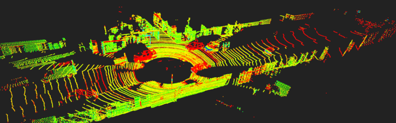
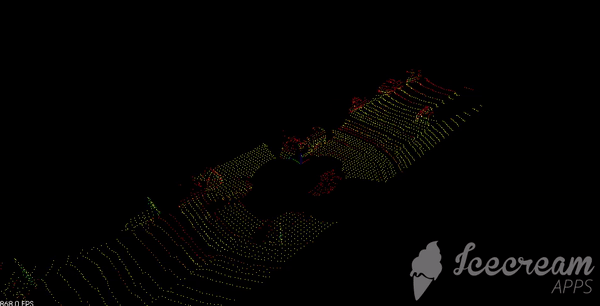
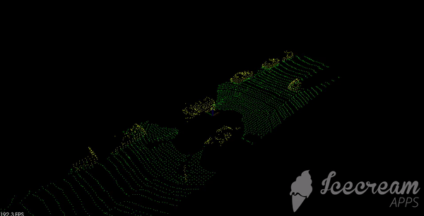

# Lidar-Object-Detection
* This repo is for the Lidar object detection project from the [Udacity Sensor Fusion Engineer](https://www.udacity.com/course/sensor-fusion-engineer-nanodegree--nd313).
* The aim of the project is to perform object detection and segmentation using real pcd data provided by udacity.

**Lidar** sensing gives us high resolution data by sending out thousands of laser signals. These lasers bounce off objects, returning to the sensor where we can then determine how far away objects are by timing how long it takes for the signal to return. Also we can tell a little bit about the object that was hit by measuring the intesity of the returned signal.

# Project Directory:
The project directory should be similar to:
```
├── build                           # build files for program
│   ├── ...
│── gifs                            # stores video output from project                   
│   ├── filtered_points.gif
│   ├── bounding_box.gif
│   ├── rotated_bounding.gif
│   ├── segmented.gif
│   ├── pcd.png
├── src                     
│   ├── helper                      # helper functions for program
│   │   ├── ransac3d.h              # utility function which used to segment data points
│   ├── render                      # simulates the PI controller
│   │   ├── box.h                   # stores structs for box definition
│   │   ├── render.cpp              # function used for image display
│   │   ├── render.h                # header file for rendering images   
│   ├── sensors                     # stores lidar data
│   │   ├── data                    # stores pcd data
│   ├── environment.cpp             # main program for instantiating environment and running scripts
│   ├── processPointClouds.cpp      # contains functions for processing point clouds
│   ├── processPointClouds.h        # header file for point cloud processing
├── CMakeLists
├── Readme.md

```

## Installation
### Ubuntu 

```bash
$> sudo apt install libpcl-dev
$> cd ~
$> git clone https://github.com/udacity/SFND_Lidar_Obstacle_Detection.git
$> cd SFND_Lidar_Obstacle_Detection
$> mkdir build && cd build
$> cmake ..
$> make
$> ./environment
```

### Windows 

http://www.pointclouds.org/downloads/windows.html

# Results:
* Loading the point data cloud files from a vehicle in traffic provided by udacity.
<p align="center">

</p>

* The first step is to filter and downsample the point clouds into voxels here by reducing the data size for object detection. The voxel cube used was 0.5 m as well as restricting the view field to a 60**m** x 14**m** x 8**m** centered we get the following output.
<p align="center">

</p>

* Next step is to segment the data into obstacles and the road.
<p align="center">

</p>

**Finally** obstacle clustering and the application of bounding boxes is appled to identify seperate obstacles. There are two bounging box methods.
* The first bounding box is takes the min and maximum points of each obstacle and creates a box around it as shown.
<p align="center">

</p>
* The second uses PCA to find the minimum box representation for all obstacles.
<p align="center">

</p>

**Finally**

